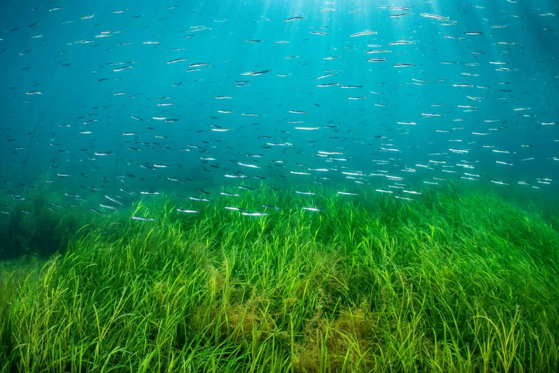

# Summary

[](https://www.google.com/url?sa=i&url=https%3A%2F%2Fwww.wwf.org.uk%2Fwhat-we-do%2Fplanting-hope-how-seagrass-can-tackle-climate-change&psig=AOvVaw0rCww3aC2vhJ8mNC7fMvv-&ust=1745424277415000&source=images&cd=vfe&opi=89978449&ved=0CBcQjhxqFwoTCLCrnaSC7IwDFQAAAAAdAAAAABAE)

## dataMares Metadata

### Project Information

**Title:** "Updating and Validating Seagrass Ecosystem Knowledge in the Gulf of California: A Comprehensive Review" **Link:** <https://www.frontiersin.org/journals/marine-science/articles/10.3389/fmars.2024.1402044/full#hsm> **Last Updated:** April 24, 2023 **Abstract:** A collection of seagrass data within the Gulf of California, detailing the distribution, extent, potential threats and levels of protection.
These data sets would guide a systematic assessment of seagrass conservation and the building of a network of collaborations.
**Keywords:** Critical habitat, Blue carbon, Spatial monitoring, Habitat conservation, Mexico, Eastern Pacific

### Research Team

**Lead Investigator:** Magali Alejandra Ramírez Zúñiga\
**Contact:** magali\@gocmarineprogram.org **Data Manager:** Santiago Domínguez, dataMares

### Data Information

**Geographic Area:** Gulf of California\
**Collection Period:** 2019-2021\
**Primary Data Format:** .xlx\
**Projection and Coordinate System:** World Geodetic System 1984-WGS84\
**Embargo:** NA\
**Usage Rights:** *To be provided by dataMares*\
**How to Cite:** *Citation will be provided by dataMares*

### Quoted Methods from Paper

"2.3 Assessing seagrass distribution and potential stressors 2.3.1 Validation and assessment of distribution decline Historical distribution records were obtained through the systematic review. On the field, we executed aerial reconnaissance to authenticate the presence or absence of seagrasses at coordinates reported in historical records. Drone flights, with altitudes oscillating between 10m and 60m, were primarily employed for intertidal seagrass detection. In addition, snorkeling expeditions complemented these aerial inspections. We classified records as “present”, when the record was validated at historically reported coordinates, when seagrasses were not found, the record was classified as “absent”. Finally, where the historical record was conspicuously imprecise (e.g., coordinates fell inland) or when pixel classification and drone imagery were unattainable, records were designated as “data deficient”. The Datasheet 1 includes information about the tools used in each location, and specific data about them.

2.3.2 Assessment of protection level We define the protection level as the existence of conservation measures for each record such as the presence of a protected area.
The visualization of this data is available at Datasheet 2.
As the presence of a protected area is not indication of active protection on the seagrass ecosystem, we also reviewed management plans to discriminate the ones mentioning seagrasses explicitly or not.
We then classified areas not protected as the ones outside any management polygon and separated protected areas according to their category established by the National Commission of Protected Natural Areas (CONANP) (e.g., National Park, Flora and Fauna protection area, Biosphere reserve, or Ramsar site).
We used spatial data from government digital repositories (Comisión Nacional de Áreas Naturales Protegidas, 2021) Natural Protected Area locations, utilizing Geographical Information Systems (QGIS, v. 3.18).

2.3.3 Assessment of potential human and climate stressors We identified potential human stressors based on the presence of activities known to harm seagrass health and gauged climate stressors using marine heatwave frequency as a proxy.
Due to the varied thermal tolerances of species and a lack of specific quantitative data, we propose that increased marine heatwave frequency, indicative of extreme climate events, suggests elevated ecosystem stress.

For human stressors, we consulted scientific literature, local reports, and protected area management plans from governmental archives.
We noted the presence of activities such as agricultural runoff leading to eutrophication, coastal development activities like construction and dredging that destroy habitats, and harmful fishing practices.
These stressors often co-occur, amplifying their impact.
Spatial correlation to localities was conducted using QGIS.

Regarding climate stressors, we analyzed sea surface temperature (SST) data from the Reynolds’ OISST dataset, spanning 1982-2020, with a resolution of 0.25 x 0.25 degrees.
Marine heatwaves, defined as periods where daily SSTs exceeded the 90th percentile threshold for at least five consecutive days, were identified and their frequency was modeled using a GLM with a Poisson distribution in R, utilizing the “heatwaveR” package (Hobday et al., 2016; Schlegel and Smit, 2018).
Rates of change in heatwave frequency were calculated for each grid point and used as a proxy for potential future impacts, normalized on a 0-1 scale for compatibility with other criteria.
Detailed methodologies and additional statistical treatments are provided in the Datasheet 2."

### Attribute Table Description

| Field                   | Description                                                                                    |
|--------------------------|----------------------------------------------|
| ID                      | Unique key for each record. Chronologically assigned                                           |
| Specie                  | Registered species                                                                             |
| Year                    | Year in which the species was registered                                                       |
| Month                   | Month in which the species was registered                                                      |
| Author                  | Indicate the name(s) of the authors of each publication                                        |
| Locality                | Locality in which the species was registered                                                   |
| Latitude                | Latitude in which the species was registered                                                   |
| Longitude               | Longitude in which the species was registered                                                  |
| Depth                   | Depth in meters in which the species was registered                                            |
| Area                    | Meadow extension in square meters                                                              |
| Reference               | Title of the publication or document                                                           |
| ANP                     | Natural Protected Area within which seagrasses are located                                     |
| Validation method       | Method used to validate records                                                                |
| Validation              | Status of the records: yes = present, not = absent, ND = data deficient                        |
| Validation_score        | Score assigned to validations: yes = 0, not = 1, DD = 0.5                                      |
| Pollution               | Score assigned to pollution: present = 1, absent = 0                                           |
| Coastal.Modification    | Score assigned to coastal modification: present = 1, absent = 0                                |
| Biological.Resource.Use | Score assigned to biological resource use: present = 1, absent = 0                             |
| MHWs                    | Average marine heat waves                                                                      |
| Protection.Level        | Level of protection of areas where seagrasses are recorded: high = 1, mean = 0.5, low/null = 0 |
| Zone                    | Spatial cluster of the localities where seagrasses have been reported                          |
| State                   | States of the Mexican Republic where seagrasses have been registered                           |
| Region                  | Bioregions of the Gulf of California where seagrasses are recorded                             |

# Setup

```{r}
library(ohicore)
library(tidyverse)
library(stringr)
library(here)
library(janitor)
library(plotly)
library(readxl)
library(tictoc)
library(ggplot2)
library(leaflet)
library(sf)
library(viridis)
library(dplyr)


# ---- sources! ----
# source(here("workflow", "R", "common.R")) # file creates objects to process data
## set the mazu and neptune data_edit share based on operating system
dir_M             <- c('Windows' = '//mazu.nceas.ucsb.edu/ohi',
                       'Darwin'  = '/Volumes/ohi',    ### connect (cmd-K) to smb://mazu/ohi
                       'Linux'   = '/home/shares/ohi')[[ Sys.info()[['sysname']] ]]

# ---- set year and file path info ----
current_year <- 2025 # Update this in the future!!
version_year <- paste0("v",current_year)
data_dir_version_year <- paste0("d", current_year)

# ---- data directories ----

# raw data directory (on Mazu)
raw_data_dir <- here::here(dir_M, "OHI_GOC", "_raw_data")

# for seagrass raw data dir
seagrass_raw_dir <- here::here(dir_M, "OHI_GOC", "_raw_data", "hab_seagrass")

# for coastline characteristics intermediates
int_dir <- here::here("hab", "hab_wetlands", version_year, "int")

# final output dir
output_dir <- here("hab", "hab_wetlands", version_year, "output")

# spatial data for GoC
goc_spatial <- here("spatial")

# this CRS might be better for visualization, explore.
gulf_crs <- st_crs("+proj=aea +lat_1=23 +lat_2=30 +lat_0=25 +lon_0=-110 +datum=WGS84 +units=m +no_defs")
```

# Explore

```{r}
# read in the raw data downloaded from the UCSD site through dataMares
seagrass_distribution_raw1 <- read_xlsx(here::here(seagrass_raw_dir, "d2025","Data_Sheet_1_seagrass_ecosystem_knowledge.xlsx"), sheet = 1) # the coordinates and data on each seagrass patch

# clean up column names
seagrass_distribution_clean <- seagrass_distribution_raw1 %>% 
  janitor::clean_names()

# make an sf object
seagrass_goc_sf <- st_as_sf(seagrass_distribution_clean, coords = c("longitude", "latitude"), crs = 4326)
mapview(seagrass_goc_sf)
head(seagrass_goc_sf) # looks correct, maintained attributes
st_crs(seagrass_goc_sf) # good, WGS 84 for now

# save point data to Mazu 
write_sf(seagrass_goc_sf, here::here(dir_M, "OHI_GOC/_raw_data/hab_seagrass/d2025/int/seagrass_point_sf_wgs84.shp"))
```
# Interactive maps for further exploration

## Color by species, size by actual area

```{r}
# only include the observations with associated area
seagrass_goc_sf_radius <- seagrass_goc_sf %>%
  mutate(
    area_m2 = as.numeric(area_m2), # all "DD" becomes an NA
    radius = sqrt(area_m2/pi) # calculate radius in meters from area (area = pi*r^2)
  )

# make a color palette based on species
pal <- colorFactor(palette = "viridis", domain = seagrass_goc_sf$specie)

# interactive leaflet map for seagrass! ~ species
seagrass_area_map <- leaflet(seagrass_goc_sf_radius) %>%
  addProviderTiles("Esri.OceanBasemap", group = "Ocean Basemap") %>%
  addProviderTiles("CartoDB.Positron", group = "Light Map") %>%
  addProviderTiles("Esri.WorldImagery", group = "Satellite") %>% 
  addCircles(
    radius = ~radius,  # This will use the actual radius in meters
    color = ~pal(specie),
    fillColor = ~pal(specie),
    fillOpacity = 0.5,
    stroke = TRUE,
    weight = 1,
    popup = ~paste(
      "<b>Species:</b>", specie, "<br>",
      "<b>Area:</b>", round(area_m2, 2), "m²<br>",
      "<b>Radius:</b>", round(radius, 2), "m<br>",
      "<b>Locality:</b>", locality, "<br>",
      "<b>Year:</b>", year
    )
  ) %>%
  addLegend(
    position = "bottomright",
    pal = pal,
    values = ~specie,
    title = "Seagrass Species"
  ) %>% 
  addLayersControl(
    baseGroups = c("Ocean Basemap", "Light Map", "Satellite"),
    overlayGroups = c("Seagrass Beds"),
    options = layersControlOptions(collapsed = FALSE)
  )
seagrass_area_map %>% addScaleBar(position = "bottomleft")
```

## Filter by validation, color by pollution, no size factor

Reminder:

"2.3.1 Validation and assessment of distribution decline
Historical distribution records were obtained through the systematic review. On the field, we executed aerial reconnaissance to authenticate the presence or absence of seagrasses at coordinates reported in historical records. Drone flights, with altitudes oscillating between 10m and 60m, were primarily employed for intertidal seagrass detection. In addition, snorkeling expeditions complemented these aerial inspections. We classified records as “present”, when the record was validated at historically reported coordinates, when seagrasses were not found, the record was classified as “absent”. Finally, where the historical record was conspicuously imprecise (e.g., coordinates fell inland) or when pixel classification and drone imagery were unattainable, records were designated as “data deficient”. The Datasheet 1 includes information about the tools used in each location, and specific data about them."

Additionally, Validation	"Status of the records yes = present; not = absent; ND = data deficient" while Validation_score	"Score assigned to validations  yes = 0; not = 1; DD = 0.5".

So, I will be filtering to the records that have validations of 0.5 and 0, to show records that are validated and also data deficient.

```{r}
# first, filter the original data by whether it was validated, meaning that the presence or absence of seagrasses at coordinates reported in historical records has been authenticated
seagrass_validated_sf <- seagrass_goc_sf %>% 
  filter(validation_score %in% c(0.5, 0))

unique(seagrass_validated_sf$validation_score) # 0.5, 0, good!

# make a color palette based on pollution (where present = 1, absent = 0)
pollution_labels <- c("0" = "Non-polluted", "1" = "Polluted")
pollution_colors <- c("0" = "royalblue", "1" = "#000000")  # blue for non-polluted, black for polluted
pal <- colorFactor(palette = pollution_colors, domain = c("0", "1"))

# interactive leaflet map for seagrass! ~ pollution and validation
seagrass_pollution_map <- leaflet(seagrass_validated_sf) %>%
  addProviderTiles("Esri.OceanBasemap", group = "Ocean Basemap") %>%
  addProviderTiles("CartoDB.Positron", group = "Light Map") %>%
  addProviderTiles("Esri.WorldImagery", group = "Satellite") %>% 
  addCircles(
    color = ~pal(as.character(pollution)),  # as.character to match domain
    fillColor = ~pal(as.character(pollution)),
    fillOpacity = 0.5,
    stroke = TRUE,
    weight = 1,
    group = "Seagrass Beds",
    popup = ~paste(
      "<b>Species:</b>", specie, "<br>",
      "<b>Area:</b>", area_m2, "m²<br>",
      "<b>Pollution Status:</b>", pollution_labels[as.character(pollution)], "<br>", 
      "<b>Validation Score:</b>", validation_score, "<br>",
      "<b>Locality:</b>", locality, "<br>",
      "<b>Year registered:</b>", year
    )
  ) %>%
  addLegend(
    position = "bottomright",
    colors = c("royalblue", "#000000"), 
    labels = c("Non-polluted", "Polluted"),  # custom pollution labels
    title = "Seagrass Beds Pollution Status"
  ) %>% 
  addLayersControl(
    baseGroups = c("Ocean Basemap", "Light Map", "Satellite"),
    overlayGroups = c("Seagrass Beds"),
    options = layersControlOptions(collapsed = FALSE)
  ) %>%
  addScaleBar(position = "bottomleft")
seagrass_pollution_map
```

