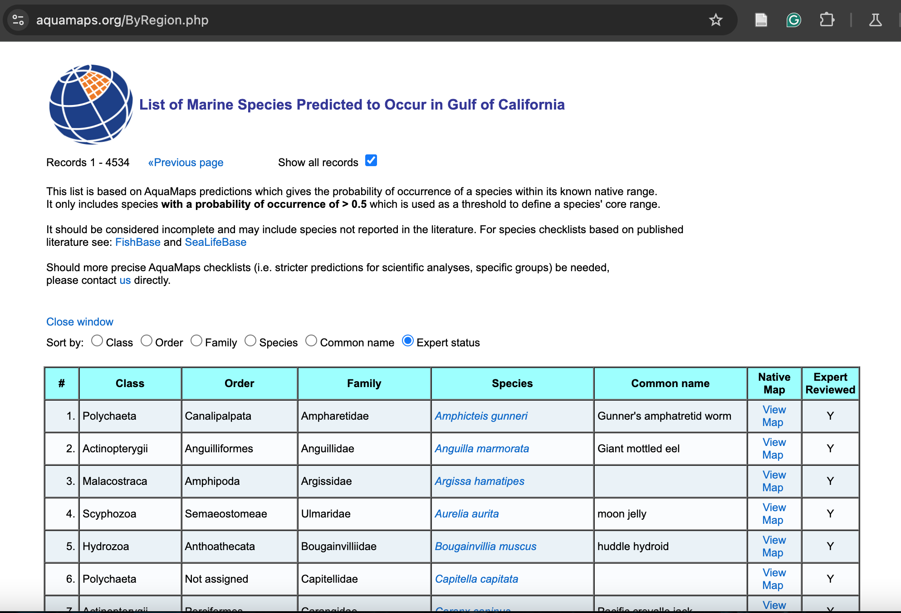
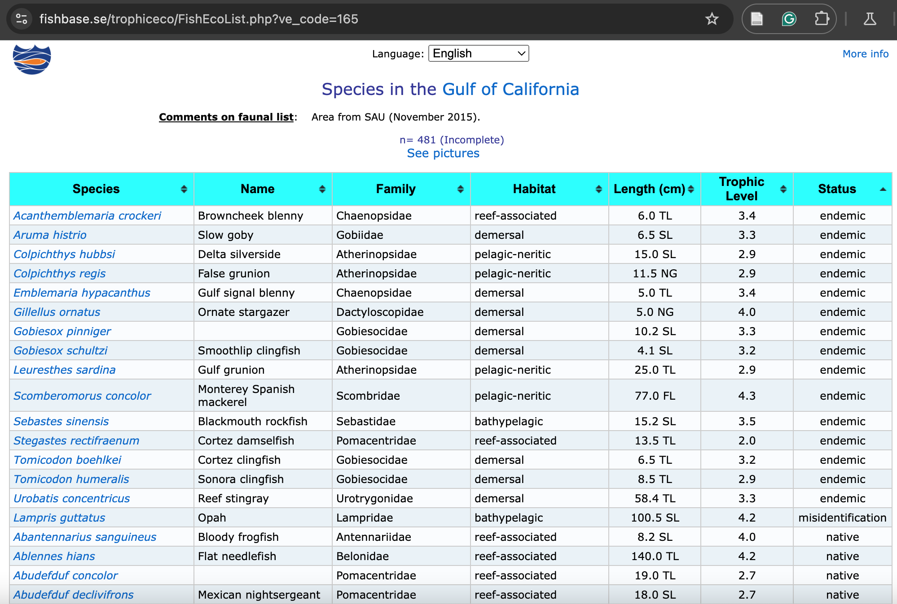
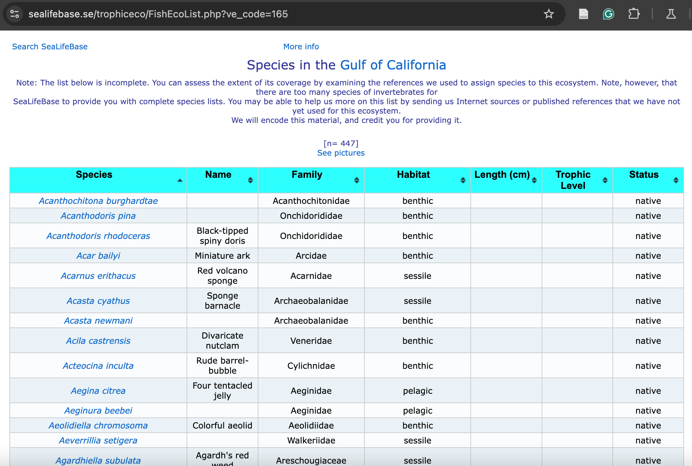
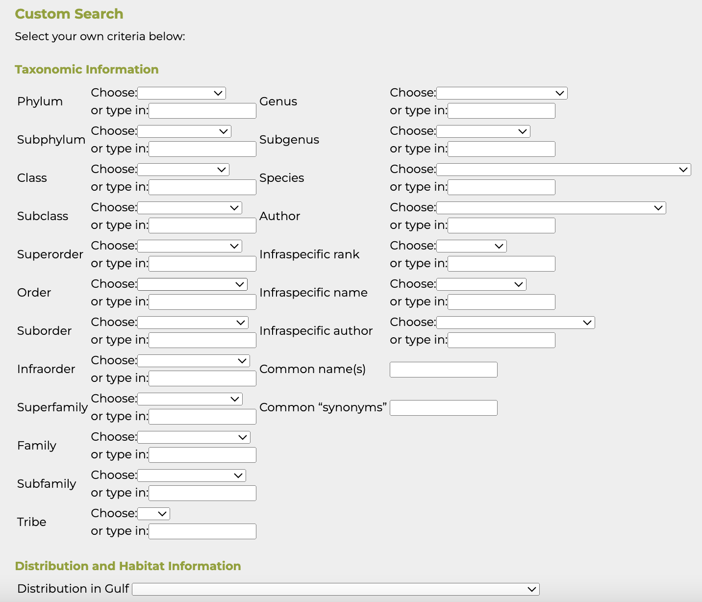
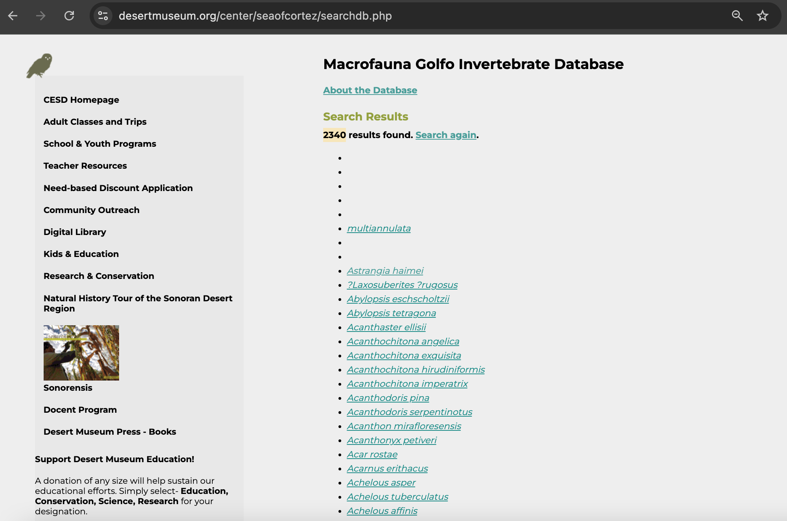

# Species Distribution for the Gulf of California

## Exploring IUCN RedList and Species Distribution

The species that inhabit the ocean have a vital role in shaping the
existing marine environment. They are valued for their beauty and
inherent right to exist, as well as their role in supporting productive
habitats that provide many benefits for people.

From the largest predators to microscopic plankton, these species depend
upon each other for survival. The interaction of species that have
naturally evolved in a given location is essential for ecosystem
structure and stability. In addition, the maintenance of large numbers
of species provides diverse genetic resource that makes it possible to
avoid functional collapse, should conditions change in the future. This
sub-goal would potentially assesses the health of all marine species
present in the Gulf of California, including endangered species and
species in relatively good conditions. The presence of species that are
not at risk leads to a higher score.

This page explores the species within the GoC, their spatial
distribution determined by the IUCN, and their corresponding species
status category.

```{r}
#| warning: false
#| message: false
#| echo: false

library(DT)
library(mapview)
library(tidyverse)
library(here)
library(plotly)
library(ggplot2)
library(leaflet)
library(sf)
library(viridis)

# read in usable processed data from `spp_exploration.qmd` in ohi_goc_prep/SPP_ICO/spp/v2025

goc_species_assessments_xref_viz <- read_csv(here("/home/shares/ohi/OHI_GOC/goal_prep/spp/iucn_redlist/v2025", "goc_species_assessments_xref_viz.csv"))
```

Below are the number of species within the Gulf of California that have
been designated as a specific IUCN Category, in which they could be:

-   Data Deficient (DD)

-   Least Concern (LC)

-   Near Threatened (NT)

-   Vulnerable (VU)

-   Endangered (EN)

-   Critically Endangered (CR)

-   Extinct in the Wild (EW), or

-   Extinct (EX)

To see the percentage of the total species assessed within the Gulf of
California, hover over the pie chart.

```{r}
#| warning: false
#| message: false
#| echo: false


library(plotly)

# sum the counts for each category_mex
pie_data <- goc_species_assessments_xref_viz %>%
  count(category_mex)

# Data Deficient (DD) ...
# Least Concern (LC) ...
# Near Threatened (NT) ...
# Vulnerable (VU) ...
# Endangered (EN) ...
# Critically Endangered (CR) ...
# Extinct in the Wild (EW) ...
# Extinct (EX)

# cat_order <- c("DD", "LC", "NT", "VU", "EN", "CR", "EW", "EX") # set the order for better understanding
# pie_data$category_mex <- factor(pie_data$category_mex, levels = cat_order)
# 
custom_colors <- c(
  "DD" = "darkgrey",
  "LC" = "darkgreen",
  "NT" = "#FFCc00",
  "VU" = "darkorange",
  "EN" = "black",
  "CR" = "darkred",
  "EW" = "black",
  "EX" = "purple"
)

# colors_in_data <- custom_colors[as.character(pie_data$category_mex)] # filter colors only for those in the data to preserve the order


# make the interactive pie chart for the categories!!
pie_cat_fig <- plot_ly(
  data = pie_data,
  labels = ~category_mex,
  values = ~n,
  type = "pie",
  textinfo = "label+percent",
  insidetextorientation = "radial",
  marker = list(colors = custom_colors[pie_data$category_mex],
                line = list(color = 'white', width = 1))  # white borders between slices
) %>%
  layout(
    showlegend = TRUE,
    legend = list(title = list(text = '<b>Red List Categories</b>'))
)

pie_cat_fig
```

Additionally, if you would like to see which species have been
designated as a certain IUCN Status Category, feel free to search or
explore below:

```{r}
#| warning: false
#| message: false
#| echo: false

goc_species_assessments_xref_viz_nocodetype <- goc_species_assessments_xref_viz %>% 
  select(-code_type)

# library(reactable)
# 
# reactable(
#   goc_species_assessments_xref_viz_nocodetype,
#   groupBy = "category_mex",
#   searchable = TRUE,
#   filterable = TRUE,
#   striped = TRUE,
#   highlight = TRUE,
#   columns = list(
#     id_no = colDef(name = "ID Number"),
#     sci_name = colDef(name = "Scientific Name"),
#     category_mex = colDef(name = "Red List Category (Mexico)"),
#     category_goc = colDef(name = "Red List Category (GOC)"),
#     category_maintained = colDef(name = "Category Maintained"),
#     year_published = colDef(name = "Year Published"),
#     latest = colDef(name = "Latest Assessment"),
#     possibly_extinct = colDef(name = "Possibly Extinct"),
#     possibly_extinct_in_the_wild = colDef(name = "Possibly Extinct in the Wild"),
#     url = colDef(name = "URL"),
#     assessment_id = colDef(name = "Assessment ID"),
#     code = colDef(name = "Country")
#   )
# )

library(DT)
library(dplyr)

# prep the data
goc_species_assessments_dt <- goc_species_assessments_xref_viz_nocodetype %>%
  rename(
    "ID Number" = id_no,
    "Scientific Name" = sci_name,
    "Red List Category (Mexico)" = category_mex,
    "Red List Category (GOC)" = category_goc,
    "Category Maintained" = category_maintained,
    "Year Published" = year_published,
    "Latest Assessment" = latest,
    "Possibly Extinct" = possibly_extinct,
    "Possibly Extinct in the Wild" = possibly_extinct_in_the_wild,
    "URL" = url,
    "Assessment ID" = assessment_id,
    "Country" = code
  )

# render interactive datatable
datatable(
  goc_species_assessments_dt,
  filter = "top",        # Enables column-wise filtering
  options = list(
    pageLength = 10,     # Number of rows per page
    autoWidth = TRUE,
    searchHighlight = TRUE,
    lengthMenu = c(5, 10, 25, 50),
    columnDefs = list(
      list(
        targets = which(names(goc_species_assessments_dt) == "URL") - 1,
        render = JS(
          "function(data, type, row, meta) {",
          "return type === 'display' && data != null ?",
          "'<a href=\"' + data + '\" target=\"_blank\">' + data + '</a>' : data;",
          "}"
        )
      )
    )
  ),
  escape = FALSE  # To allow rendering HTML links
)
```

### IUCN Group Spatial Distributions

Within IUCN Species Distribution maps, there are 19 groups that have
vector (polygon) data available for downloading. These groups are as
follows:

```{r}
#| warning: false
#| message: false
#| echo: false


library(knitr)
library(kableExtra)

groups <- c(
  "Abalone",
  "Cone Snails",
  "Croakers & Drums",
  "Eels",
  "Groupers",
  "Hagfish",
  "Lobsters",
  "Mammals (Marine Only)",
  "Mangroves",
  "Marinefish",
  "Reef Forming Corals",
  "Salmonids",
  "Seabreams, Snappers, Grunts",
  "Seagrasses",
  "Sharks, Rays, Chimaeras",
  "Sturgeons & Paddlefishes",
  "Syngnathiform Fishes",
  "Tunas, Billfishes, Swordfish",
  "Wrassess & Parrotfish"
)

df <- data.frame("Groups available for download" = groups, check.names = FALSE)

kable(df, "html") %>%
  kable_styling(full_width = FALSE, position = "center")

```

#### Polygon distribution example: Seabreams, Snappers, and Grunts

To show an example of what the polygons available for download look like
within the GoC, here is a map of seabreams, snappers, and grunts, along
with what the data itself looks like:

```{r}
#| warning: false
#| message: false
#| echo: false

seabreams_snappers_grunts <- st_read(here("/home/shares/ohi/OHI_GOC/_raw_data/IUCN_spatial/d2025/int/seabreams_snappers_grunts_dist_goc_wgs84.shp"), quiet = TRUE)

mapview(seabreams_snappers_grunts, label = seabreams_snappers_grunts$sci_name, layer.name = "Seabreams, snappers, and grunts")
# 
# leaflet(seabreams_snappers_grunts) %>%
#   addProviderTiles("OpenStreetMap") %>%
#   addPolygons(
#     label = ~sci_name,
#     popup = ~sci_name,
#     color = "darkblue",
#     weight = 1,
#     fillOpacity = 0.5
#   )

datatable(head(st_drop_geometry(seabreams_snappers_grunts), 10))
```

### How to use the IUCN RedList

To download a list of the species evaluated within a country, use the
IUCN API website (https://api.iucnredlist.org/), click the “Generate a
token” link at the top of the web page, and fill out the form to apply
for a token. You should then receive a token after completing the form.
After receiving a token, open the .Renviron file on your computer (e.g.,
using usethis::edit_r_environ()).

Then, within your code, type:

```{r}
# usethis::edit_r_environ() # and add the token as "IUCN_REDLIST_KEY"
```

Then, to verify access to IUCN Red List API:

```{r}
# rredlist::rl_use_iucn() # make sure you did the above ^!
```

To obtain the species distribution data from IUCN, manual polygon
downloads are available at
<https://www.iucnredlist.org/resources/spatial-data-download>. The API
will give the list of the status and name of all species in Mexico, but
it does not have any spatial data associated with it (such as
locations/coordinates seen). After downloading all marine groups
manually and cropping it to the GoC, you will be able to match it with
listed species and their status from `mex_species`. It is possible there
are more taxonomic group distribution data than are listed, which is
okay and still good to explore.

Note: there are 19 groups (separate downloads) for spatial data. Mazu
location is /home/shares/ohi/OHI_GOC/\_raw_data/IUCN_spatial/d2025.
After requesting each group, go to your account page under "saved
downloads". There, all requested downloads will be present. Download
each group and unzip, then bring into Mazu for the appropriate year.

## Comparing with AquaMaps, FishBase, and SeaLifeBase

AquaMaps, FishBase, and SeaLifeBase are great resources with different
strengths.

-   **AquaMaps** visualizes and predicts *species distributions* using
    data from FishBase and SeaLifeBase.

-   **FishBase** is the authoritative database for *fish species*.

-   **SeaLifeBase** is the authoritative database for all other aquatic
    life *except* fish.

### AquaMaps

AquaMaps is a tool that generates model based, large-scale predictions
of where aquatic species are likely to occur. It uses environmental
data, such as temperature, depth, and salinity, along with species
occurrence records to create global, color-coded maps showing the
relative probability of finding a species in different areas. These maps
are routinely verified using information from FishBase and SeaLifeBase,
and can also be reviewed by species experts for accuracy. AquaMaps is
especially useful for visualizing and predicting marine and freshwater
species distributions worldwide.



To find this data on their website, go to "Checklists by Large Marine
Ecosystem" and select within the drop-down menu "Gulf of California".
The NetCDF distributions of each species can be downloaded using either
the [`aquamapsdata`
package](https://raquamaps.github.io/aquamapsdata/articles/intro.html)
or the THREDDS server at
<http://thredds.d4science.org/thredds/catalog/public/netcdf/AquamapsNative/catalog.html>.

**AquaMaps data description**: This list is based on AquaMaps
predictions which gives the probability of occurrence of a species
within its known native range. It only includes species with a
probability of occurrence of \> 0.5 which is used as a threshold to
define a species' core range. It should be considered incomplete and may
include species not reported in the literature. For species checklists
based on published literature see: FishBase and SeaLifeBase. Should more
precise AquaMaps checklists (i.e. stricter predictions for scientific
analyses, specific groups) be needed, please contact us directly.

**Disclaimer**: *AquaMaps generates standardized computer-generated and
fairly reliable large scale predictions of marine and freshwater
species. Although the AquaMaps team and their collaborators have
obtained data from sources believed to be reliable and have made every
reasonable effort to ensure its accuracy, many maps have not yet been
verified by experts and we strongly suggest you verify species
occurrences with independent sources before usage. We will not be held
responsible for any consequence from the use or misuse of these data
and/or maps by any organization or individual.*

**Citation**: Kaschner, K., Kesner-Reyes, K., Garilao, C., Segschneider,
J., Rius-Barile, J. Rees, T., & Froese, R. (2019, October). AquaMaps:
Predicted range maps for aquatic species. Retrieved from
<https://www.aquamaps.org>.

### FishBase

FishBase is the world’s largest online database of information about
fish species. It covers a wide range of data, including taxonomy,
distribution, biology, ecology, and conservation status (using the IUCN
Red List assessment) for nearly all known fish species. FishBase is a
key resource for researchers, educators, and policymakers, and it also
provides common names in many languages. Data from FishBase is used to
inform and verify the species maps generated by AquaMaps.



[Click here to see the FishBase website with images for the Gulf of
California.](https://fishbase.se/identification/RegionSpeciesList.php?e_code=165)

**Disclaimer:** *FishBase present information on fishes as correctly as
possible. However, we can not exclude errors, and neither we nor our
partners can be held responsible for any damage that may arise from
these.*

**Citation:** Froese, R. and D. Pauly. Editors. 2025.FishBase. World
Wide Web electronic publication. www.fishbase.org, ( 04/2025 )

### SeaLifeBase

SeaLifeBase is a comprehensive database similar to FishBase, but it
focuses on all other aquatic life **except for finfish**, such as
invertebrates (e.g., mollusks, crustaceans, corals) and marine mammals.
It contains detailed information on the taxonomy, distribution, and
ecology of thousands of non-fish marine species. Like FishBase,
SeaLifeBase contributes essential data to AquaMaps for generating
accurate species distribution models.



However, [for the Gulf of
California](https://sealifebase.se/trophiceco/FishEcoList.php?ve_code=165),
SeaLifeBase disclaims that *"the list below is incomplete. You can
assess the extent of its coverage by examining the references we used to
assign species to this ecosystem. Note, however, that there are too many
species of invertebrates for SeaLifeBase to provide you with complete
species lists."*

Therefore, let's explore better invertebrate databases, such as the Gulf
of California Invertebrate Database from the Desert Museum.

**Citation:** Palomares, M.L.D. and D. Pauly. Editors. 2025.
SeaLifeBase. World Wide Web electronic publication. www.sealifebase.org,
version (04/2025).

## The Gulf of California Invertebrate Database

**The Invertebrate Portion of the Macrofauna Golfo Database**

The Gulf of California Invertebrate Database is a comprehensive,
regularly updated resource that catalogs all known invertebrate species
from the Gulf of California (also known as the Sea of Cortez). Hosted by
the Arizona-Sonora Desert Museum, this database is part of the larger
Macrofauna Golfo Project, which aims to document the region’s remarkable
marine biodiversity.

Curated by experts from the Arizona-Sonora Desert Museum and the
Universidad Nacional Autónoma de México, the database includes detailed
records for nearly every invertebrate group found in the Gulf, excluding
copepods and ostracods, which are still being added. Users can search
and explore species information, making it an invaluable tool for
researchers, educators, and anyone interested in the marine life of the
Gulf of California.



The database is updated **weekly**, and contributions of new information
are welcomed from the scientific community and the public.

The total number of invertebrate species documented in the database is
**2340 species.** Each species, when clicked on, contains:

-   Taxonomic information

-   Distribution and habitat information

-   Range and end-points within the Gulf of California, and

-   Comments



This information is very helpful and useful for understanding
invertebrate species richness and distribution across the Gulf of
California.

To explore the database, [click
here](https://www.desertmuseum.org/center/seaofcortez/database.php)!

**Citation:** Brusca, R. C. and M. E. Hendrickx. 2008 and onward. The
Gulf of California Invertebrate Database: The Invertebrate Portion of
the *Macrofauna Golfo* Database.
http://www.desertmuseum.org/center/seaofcortez/database.php.
