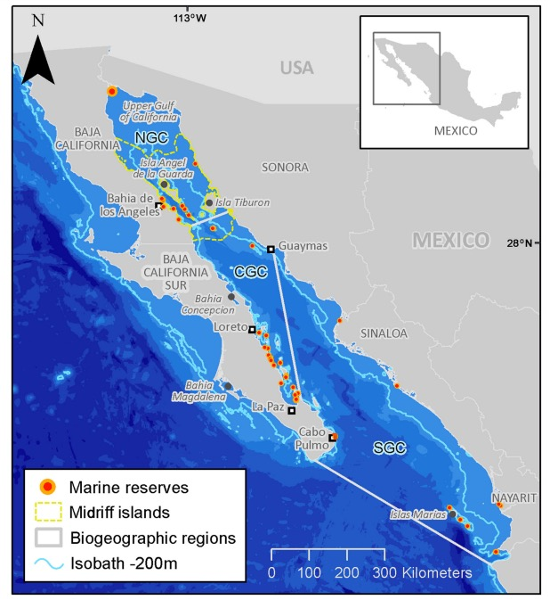
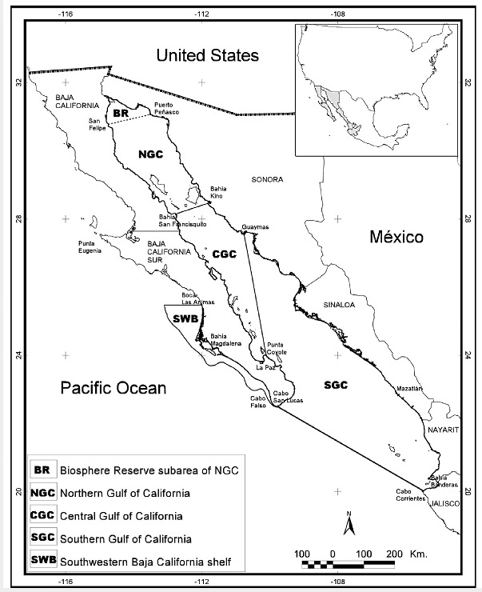
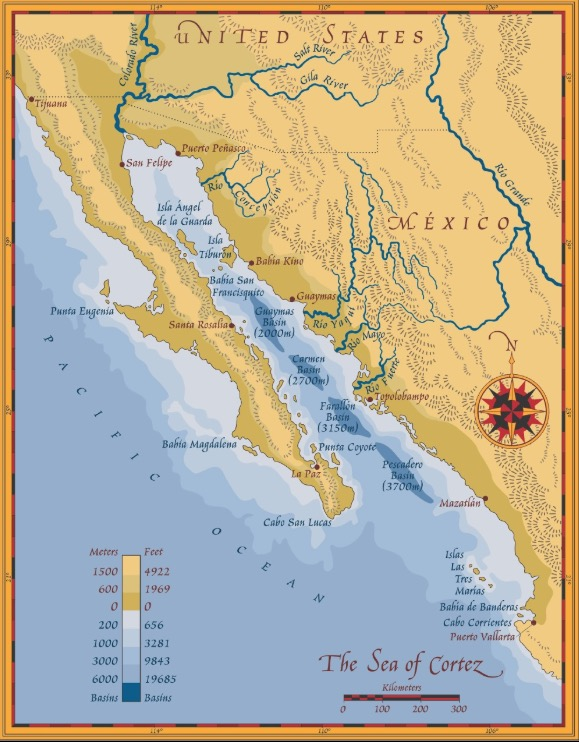

This code prepares the spatial data for the Gulf of California region. For the equal area projections, I will use Albers Equal Area EPSG:5070

Area of the GoC: 179,938 km2 (177,000 km2 according to [Wikipedia](https://en.wikipedia.org/wiki/Gulf_of_California))

```{r setup, include=FALSE, echo=FALSE, warning=FALSE, message=FALSE}
library(magrittr)
library(mregions2)
library(mapview)
library(sf)
library(tidyverse)
library(lwgeom)
library(here)
library(leaflet.extras2)

# this CRS might be better for visualization, explore.
gulf_crs <- "+proj=aea +lat_1=23 +lat_2=30 +lat_0=25 +lon_0=-110 +datum=WGS84 +units=m +no_defs"

```

*STEP 1* Obtain high resolution polygon of Gulf of California region

Open Street Map seemed to have the highest resolution coastline data. Data downloaded from here (Dec 18 2024): <https://osmdata.openstreetmap.de/data/water-polygons.html>

Combined with data from: <https://www.marineregions.org/downloads.php> to get border data.

*STEP 2* Make some decisions

### Question 1: Should we follow the Gulf of California boundary? Or, should we follow the Ecoregion boundary?

#### Boundary 1: Ecoregion

```{r, echo=FALSE, warning=FALSE, message=FALSE, results="hide"}

coastline <- st_read("/home/shares/ohi/OHI_GOC/spatial/water-polygons-split-4326/water_polygons.shp")

# select the ones relevant to Gulf of California
# mapview(coastline[1:2000,]) #figure out how the data are arranged
valids <- st_is_valid(coastline)
coastline_valid <- coastline[valids, ] # some not valid, but not any I care about.

bbox <- c(xmin=-118.4, ymin = 14.55, xmax = -86.739, ymax = 32.718) # Mexico boundaries
coastline_mexico <- st_crop(coastline_valid, bbox)
#mapview(coastline_mexico) +
#mapview(joined_mexico, col="red")

# further crop
GoC <- coastline_mexico[c(37, 164, 187, 112, 32, 237, 3, 70, 234, 39, 31, 65, 142,
                          254, 157, 461, 202, 143, 66, 248, 159, 62, 139,
                          82, 33, 84, 241, 243, 64, 412, 136, 123, 168, 393,
                          394, 79, 140, 182, 90, 378, 377, 376, 360, 361, 362, 363,  60, 169, 161, 137, 
                          124, 242, 245, 246, 55, 56, 59, 63, 249, 113),]
#mapview(GoC, col.regions="red") + 
#  mapview(coastline_mexico, col.regions="blue")

## join these polygons together
joined_mexico <- st_union(GoC)
joined_mexico <- st_sf(geometry = joined_mexico)
#mapview(joined_mexico)

## map 1: based on Gulf of Mexico boundary
iho_mexico <- mrp_get("iho") %>%
  filter(name == "Gulf of California")
#mapview(iho_mexico)

eco_mexico <- mrp_get("ecoregions") %>%
  filter(ecoregion == "Cortezian")
#mapview(eco_mexico)

#eco
eco_line_coords <- matrix(c(
  -110.00083, 22.85750,  # Start point (x1, y1)
   -105.68781, 20.41197   # End point (x2, y2)
), ncol = 2, byrow = TRUE)

# Create the LINESTRING geometry
eco_line <- st_sfc(st_linestring(eco_line_coords), crs = 4326)
eco_line <- st_sf(geometry = eco_line)
#mapview(eco_line, color="red")+
#mapview(eco_mexico)
#mapview(eco_line, color="red")+
#mapview(joined_mexico)

eco_line <- st_geometry(eco_line)

eco_hr <- st_split(joined_mexico, eco_line)
eco_hr <- st_collection_extract(eco_hr, "POLYGON")
eco_hr <- eco_hr[1,]
eco_hr <- st_sf(geometry = eco_hr)

#mapview(eco_hr)
st_write(eco_hr, here("spatial/GoC_polygon_ecoregion_latlon.shp"), append=FALSE)
eco_hr_equal_area <- st_transform(eco_hr, 5070)
st_write(eco_hr_equal_area, here("spatial/GoC_polygon_ecoregion_eqarea.shp"), append=FALSE)
#check <- st_read(here("spatial/GoC_polygon_ecoregion_eqarea.shp"))
#mapview(check)
#plot(eco_hr_equal_area)
```


```{r, echo=FALSE, warning=FALSE, message=FALSE, results="hide"}
#iho
iho_line_coords <- matrix(c(
  -110.0000, 22.85711,  # Start point (x1, y1)
   -106.78506, 23.63325   # End point (x2, y2)
), ncol = 2, byrow = TRUE)

# Create the LINESTRING geometry
iho_line <- st_sfc(st_linestring(iho_line_coords), crs = 4326)
iho_line <- st_sf(geometry = iho_line)
#mapview(iho_line, color="red")+
#mapview(iho_mexico)
#mapview(iho_line, color="red")+
#mapview(joined_mexico)

iho_line <- st_geometry(iho_line)

iho_hr <- st_split(joined_mexico, iho_line)
iho_hr <- st_collection_extract(iho_hr, "POLYGON")
iho_hr <- iho_hr[1:3,]
iho_hr <- st_union(iho_hr)
iho_hr <- st_sf(geometry = iho_hr)

#mapview(iho_hr)

st_write(iho_hr, here("spatial/GoC_polygon_sea_latlon.shp"), append=FALSE)
iho_hr_equal_area <- st_transform(iho_hr, 5070)
#plot(iho_hr_equal_area)
st_write(iho_hr_equal_area, here("spatial/GoC_polygon_sea_eqarea.shp"), append=FALSE)
#check <- st_read(here("spatial/GoC_polygon_sea_eqarea.shp"))
#mapview(check)
#st_area(iho_hr_equal_area)

```

```{r, echo=FALSE, warning=FALSE, message=FALSE}
mapview(eco_rast, color="red") +
  mapview(eco_hr)

```

```{r, echo=FALSE, warning=FALSE, message=FALSE}
## make 1km resolution raster from each dataset.
library(terra)
bbox <- st_bbox(eco_hr_equal_area)
r <- rast(
  xmin = bbox["xmin"], xmax = bbox["xmax"],
  ymin = bbox["ymin"], ymax = bbox["ymax"],
  resolution = 1000,  # 1 km resolution
  crs = st_crs(eco_hr_equal_area)$proj4string  # Use the same CRS as your polygon
)

# Convert the sf object to a terra SpatVector
eco_shape <- vect(eco_hr_equal_area)

# Rasterize the polygon by fraction of cell covered
eco_rast <- rasterize(eco_shape, r, field = NA, touches = FALSE, cover = TRUE)
writeRaster(eco_rast, here("spatial/eco_raster_eqarea.tif"), overwrite=TRUE)

# Convert the sf object to a terra SpatVector
iho_shape <- vect(iho_hr_equal_area)

# Rasterize the polygon by fraction of cell covered
iho_rast <- rasterize(iho_shape, r, field = NA, touches = FALSE, cover = TRUE)
writeRaster(iho_rast, here("spatial/iho_raster_eqarea.tif"), overwrite=TRUE)
```

### Question 2: Should we include subregions?

Should we have one OHI score that represents the entire region? We can make further divisions according to ecoregions, estados, etc. The region is fairly small, so I'm not convinced subdivision makes sense.

This image provides estados and ecoregions boundaries:



This image provides ecoregion boundaries:

This image provides a useful view of the primary river inputs (for reference):



```{r, include=FALSE, echo=FALSE, warning=FALSE, message=FALSE, results="hide"}

# Extra code describing how to to get regions using R package from 
# from Marine regions, get boundaries
## Explore the datasets from Marine Regions
mrp_list %>%data.frame()
mrp_view("iho")
mrp_view("ecoregions")
mrp_view("eez_iho")
mrp_view("eez_land")
mrp_view("goas")
tmp <- mrp_get("eez_land") %>%
  filter(union == "Mexico")

gaz_search("Mexico") %>% data.frame()
mexico_land <- gaz_geometry(2224, format="sfc")
mexico_land <- st_sf(geometry = mexico_land)
mapview(mexico_land)

eez_land_mexico <- mrp_get("eez_land") %>%
  filter(union == "Mexico")
mapview(eez_land_mexico)

eez_mexico <- mrp_get("eez") %>%
  filter(geoname == "Mexican Exclusive Economic Zone")
mapview(eez_mexico)

eco_mexico <- mrp_get("ecoregions") %>%
  filter(ecoregion == "Cortezian")
mapview(eco_mexico)

gaz_search("Mexico") %>% data.frame()
mexico_land <- gaz_geometry(2224, format="sfc")
mexico_land <- st_sf(geometry = mexico_land)
mapview(mexico_land)
mexico_land_extend <- st_buffer(mexico_land, dist = 0.5)
mapview(mexico_land_extend)

land_plus_iho <- st_union(c(st_geometry(iho_mexico), st_geometry(mexico_land))) 
land_plus_iho <- st_sf(geometry = land_plus_iho)
mapview(land_plus_iho)

land_plus_eco <- st_union(c(st_geometry(eco_mexico), st_geometry(mexico_land_extend))) 
land_plus_eco <- st_sf(geometry = land_plus_eco)
mapview(land_plus_eco)

```

## Other resources
Watersheds: https://databasin.org/datasets/5637f67d31d94a1cb165cdbddb8c4257/
/home/shares/ohi/OHI_GOC/spatial/Major Watersheds of Mexico