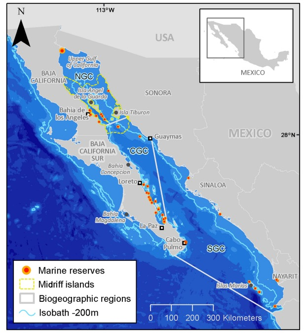
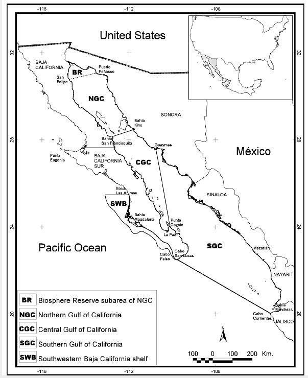
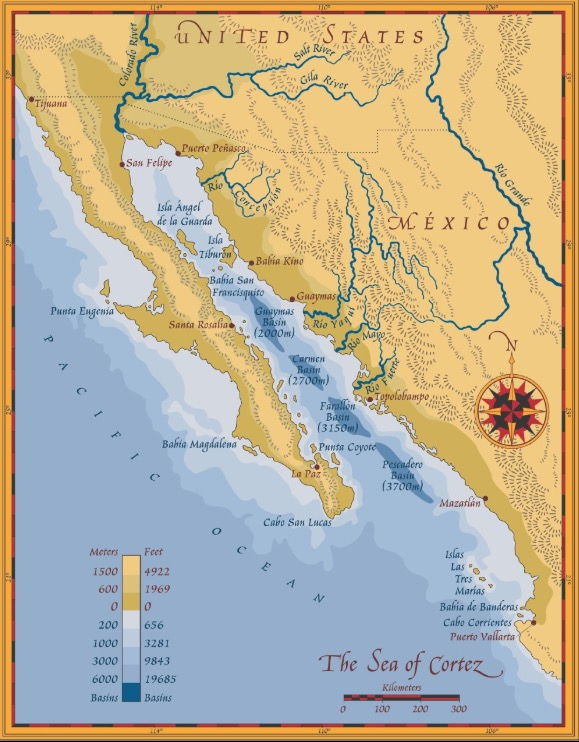
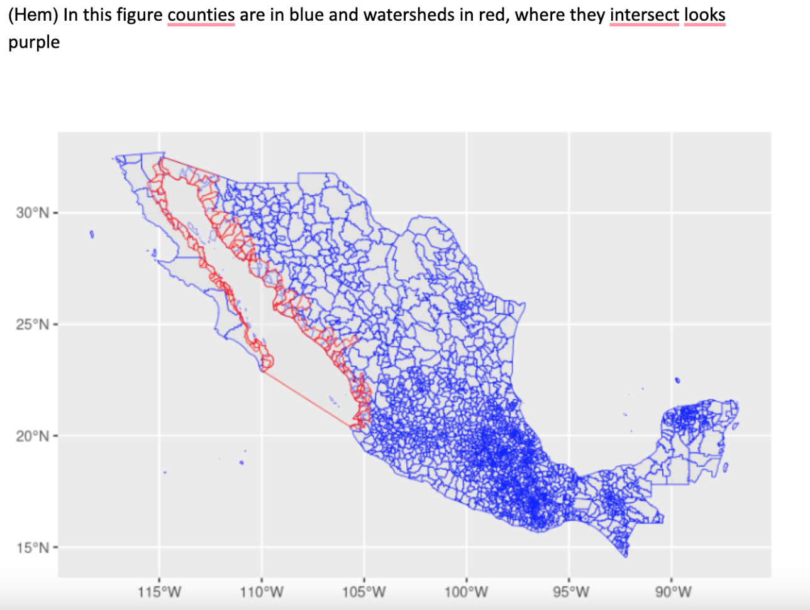

This code prepares the spatial data for the Gulf of California region. For the equal area projections, I will use Albers Equal Area EPSG:5070

Area of the GoC: 179,938 km2 (177,000 km2 according to [Wikipedia](https://en.wikipedia.org/wiki/Gulf_of_California))

```{r setup, include=FALSE, echo=FALSE, warning=FALSE, message=FALSE}
library(magrittr)
library(mregions2)
library(mapview)
library(sf)
library(tidyverse)
library(lwgeom)
library(here)
library(leaflet.extras2)
library(terra)

# this CRS might be better for visualization, explore.
gulf_crs <- "+proj=aea +lat_1=23 +lat_2=30 +lat_0=25 +lon_0=-110 +datum=WGS84 +units=m +no_defs"

```

*STEP 1* Obtain high resolution polygon of Gulf of California region

Open Street Map has the highest resolution coastline data. Data downloaded from here (Dec 18 2024): <https://osmdata.openstreetmap.de/data/water-polygons.html>

Combined with data from: <https://www.marineregions.org/downloads.php> to get border data.

*STEP 2* Make some decisions

### Question 1: Should we follow the Gulf of California political boundary? Or, should we follow the Ecoregion boundary?

```{r, echo=FALSE, warning=FALSE, message=FALSE, results="hide", eval=FALSE}

coastline <- st_read("/home/shares/ohi/OHI_GOC/spatial/water-polygons-split-4326/water_polygons.shp")

# select the ones relevant to Gulf of California
# mapview(coastline[1:2000,]) #figure out how the data are arranged
valids <- st_is_valid(coastline)
coastline_valid <- coastline[valids, ] # some not valid, but not any I care about.

bbox <- c(xmin=-118.4, ymin = 14.55, xmax = -86.739, ymax = 32.718) # Mexico boundaries
coastline_mexico <- st_crop(coastline_valid, bbox)
#mapview(coastline_mexico) +
#mapview(joined_mexico, col="red")

# further crop
GoC <- coastline_mexico[c(37, 164, 187, 112, 32, 237, 3, 70, 234, 39, 31, 65, 142,
                          254, 157, 461, 202, 143, 66, 248, 159, 62, 139,
                          82, 33, 84, 241, 243, 64, 412, 136, 123, 168, 393,
                          394, 79, 140, 182, 90, 378, 377, 376, 360, 361, 362, 363,  60, 169, 161, 137, 
                          124, 242, 245, 246, 55, 56, 59, 63, 249, 113),]
#mapview(GoC, col.regions="red") + 
#  mapview(coastline_mexico, col.regions="blue")

## join these polygons together
joined_mexico <- st_union(GoC)
joined_mexico <- st_sf(geometry = joined_mexico)
#mapview(joined_mexico)

## map 1: based on Gulf of Mexico boundary
iho_mexico <- mrp_get("iho") %>%
  filter(name == "Gulf of California")
#mapview(iho_mexico)

## map 2: based on ecoregion boundary
eco_mexico <- mrp_get("ecoregions") %>%
  filter(ecoregion == "Cortezian")
#mapview(eco_mexico)

#couldn't get clip to work, so had to draw lines by hand based on references

#eco
eco_line_coords <- matrix(c(
  -110.00083, 22.85750,  # Start point (x1, y1)
   -105.68781, 20.41197   # End point (x2, y2)
), ncol = 2, byrow = TRUE)

# Create the LINESTRING geometry
eco_line <- st_sfc(st_linestring(eco_line_coords), crs = 4326)
eco_line <- st_sf(geometry = eco_line)
#mapview(eco_line, color="red")+
#mapview(eco_mexico)
#mapview(eco_line, color="red")+
#mapview(joined_mexico)

eco_line <- st_geometry(eco_line)

eco_hr <- st_split(joined_mexico, eco_line)
eco_hr <- st_collection_extract(eco_hr, "POLYGON")
eco_hr <- eco_hr[1,]
eco_hr <- st_sf(geometry = eco_hr)

#mapview(eco_hr)
st_write(eco_hr, here("spatial/GoC_polygon_ecoregion_latlon.shp"), append=FALSE, quiet=TRUE)
eco_hr_equal_area <- st_transform(eco_hr, 5070)
st_write(eco_hr_equal_area, here("spatial/GoC_polygon_ecoregion_eqarea.shp"), append=FALSE, quiet=TRUE)
#check <- st_read(here("spatial/GoC_polygon_ecoregion_eqarea.shp"))
#mapview(check)
#plot(eco_hr_equal_area)
```

```{r, echo=FALSE, warning=FALSE, message=FALSE, results="hide", eval=FALSE}
#iho
iho_line_coords <- matrix(c(
  -110.0000, 22.85711,  # Start point (x1, y1)
   -106.78506, 23.63325   # End point (x2, y2)
), ncol = 2, byrow = TRUE)

# Create the LINESTRING geometry
iho_line <- st_sfc(st_linestring(iho_line_coords), crs = 4326)
iho_line <- st_sf(geometry = iho_line)
#mapview(iho_line, color="red")+
#mapview(iho_mexico)
#mapview(iho_line, color="red")+
#mapview(joined_mexico)

iho_line <- st_geometry(iho_line)

iho_hr <- st_split(joined_mexico, iho_line)
iho_hr <- st_collection_extract(iho_hr, "POLYGON")
iho_hr <- iho_hr[1:3,]
iho_hr <- st_union(iho_hr)
iho_hr <- st_sf(geometry = iho_hr)

#mapview(iho_hr)

st_write(iho_hr, here("spatial/GoC_polygon_sea_latlon.shp"), append=FALSE, quiet=TRUE)
iho_hr_equal_area <- st_transform(iho_hr, 5070)
#plot(iho_hr_equal_area)
st_write(iho_hr_equal_area, here("spatial/GoC_polygon_sea_eqarea.shp"), append=FALSE, quiet=TRUE)
#check <- st_read(here("spatial/GoC_polygon_sea_eqarea.shp"))
#mapview(check)
#st_area(iho_hr_equal_area)

```

```{r, echo=FALSE, warning=FALSE, message=FALSE, eval=FALSE}
## make 1km resolution raster from each dataset.
bbox <- st_bbox(eco_hr_equal_area)
r <- rast(
  xmin = bbox["xmin"], xmax = bbox["xmax"],
  ymin = bbox["ymin"], ymax = bbox["ymax"],
  resolution = 1000,  # 1 km resolution
  crs = st_crs(eco_hr_equal_area)$proj4string  # Use the same CRS as your polygon
)

# Convert the sf object to a terra SpatVector
eco_shape <- vect(eco_hr_equal_area)

# Rasterize the polygon by fraction of cell covered
eco_rast <- rasterize(eco_shape, r, field = NA, touches = FALSE, cover = TRUE)
writeRaster(eco_rast, here("spatial/eco_raster_eqarea.tif"), overwrite=TRUE)

# Convert the sf object to a terra SpatVector
iho_shape <- vect(iho_hr_equal_area)

# Rasterize the polygon by fraction of cell covered
iho_rast <- rasterize(iho_shape, r, field = NA, touches = FALSE, cover = TRUE)
writeRaster(iho_rast, here("spatial/iho_raster_eqarea.tif"), overwrite=TRUE)
```

```{r, echo=FALSE, warning=FALSE, message=FALSE}

eco_hr <- st_read(here("spatial/GoC_polygon_ecoregion_latlon.shp"), quiet=TRUE)
eco_hr$label <- "ecoregion boundary"

# mapview(eco_hr)

iho_hr <- st_read(here("spatial/GoC_polygon_sea_latlon.shp"), quiet=TRUE)
iho_hr$label <- "political boundary"

# mapview(iho_hr)

mapview(iho_hr, col.regions="red", zcol="label") +
  mapview(eco_hr, zcol="label")

```

### Question 2: Should we include subregions?

Should we have one OHI score that represents the entire region? We can make further divisions according to ecoregions, estados, etc. The region is fairly small, so I'm not convinced subdivision makes sense.

This image provides estados and ecoregions boundaries:



This image provides ecoregion boundaries:  This image provides a useful view of the primary river inputs (for reference): 

```{r, include=FALSE, echo=FALSE, warning=FALSE, message=FALSE, results="hide", eval=FALSE}

# Extra code describing how to to get regions using R package from 
# from Marine regions, get boundaries
## Explore the datasets from Marine Regions
mrp_list %>%data.frame()
mrp_view("iho")
mrp_view("ecoregions")
mrp_view("eez_iho")
mrp_view("eez_land")
mrp_view("goas")
tmp <- mrp_get("eez_land") %>%
  filter(union == "Mexico")

gaz_search("Mexico") %>% data.frame()
mexico_land <- gaz_geometry(2224, format="sfc")
mexico_land <- st_sf(geometry = mexico_land)
mapview(mexico_land)

eez_land_mexico <- mrp_get("eez_land") %>%
  filter(union == "Mexico")
mapview(eez_land_mexico)

eez_mexico <- mrp_get("eez") %>%
  filter(geoname == "Mexican Exclusive Economic Zone")
mapview(eez_mexico)

eco_mexico <- mrp_get("ecoregions") %>%
  filter(ecoregion == "Cortezian")
mapview(eco_mexico)

gaz_search("Mexico") %>% data.frame()
mexico_land <- gaz_geometry(2224, format="sfc")
mexico_land <- st_sf(geometry = mexico_land)
mapview(mexico_land)
mexico_land_extend <- st_buffer(mexico_land, dist = 0.5)
mapview(mexico_land_extend)

land_plus_iho <- st_union(c(st_geometry(iho_mexico), st_geometry(mexico_land))) 
land_plus_iho <- st_sf(geometry = land_plus_iho)
mapview(land_plus_iho)

land_plus_eco <- st_union(c(st_geometry(eco_mexico), st_geometry(mexico_land_extend))) 
land_plus_eco <- st_sf(geometry = land_plus_eco)
mapview(land_plus_eco)

```

## Other resources

Watersheds: <https://databasin.org/datasets/5637f67d31d94a1cb165cdbddb8c4257/> /home/shares/ohi/OHI_GOC/spatial/Major Watersheds of Mexico

## Updated regions

### Inland boundary
Use inland watershed boundaries for now! We can decide from there.

Use Faro de Cabo Corrientes as the southeastern boundary, dart up the continental shelf, and connect to Cabo del Este southwestern boundary.

```{r}
# read in watersheds from mexico
watersheds_mexico <- st_read(here("/home/shares/ohi/OHI_GOC/spatial/Major Watersheds of Mexico/data/commondata/data0/MEXICO_allbasins_Diss_Lambert.shp")) # CRS = North_America_Lambert_Conformal_Conic
mapview(watersheds_mexico)

# reproject to WGS 84 to align with mapview
watersheds_mexico_reproj <- st_transform(watersheds_mexico, st_crs(eco_hr))
# mapview(watersheds_mexico_reproj)
```

 

The image is located [here](https://docs.google.com/document/d/1m-cYhNwUm9I_iaC2oXYJDUAIVvi--2HLPQhiEDwwxf4/edit?tab=t.mg1p6em671r2).

Here we can see that the watersheds from databasin actually do not look very similar to the watersheds from Hem's data, which makes me think they may be using different ways to delineate between watersheds. Or that Hem's is more updated. Example: the tip of the peninsula by La Paz looks very different and much more segmented in the watersheds_mexico_proj.

Let's look at one from INEGI:

Theme:	Hydrography
State:	United Mexican States
Edition:	2006
Format:	Electronic
Scale:	1:250,000
Date:	ITRF92

THE DIGITAL HYDROGRAPHIC NETWORK OF MEXICO SCALE 1:250 000, Edition 1.0. It is the result of connecting and giving logical sense according to the topography, rivers, streams, canals and aqueducts; the procedure consists of generating, by automated and semi-automated means, the continuity in the trace from the source of a water current to its mouth to the sea, inland body of water or when it disappears due to some process of infiltration into the subsoil. The drainage network is basically defined as a system of channels through which surface and subsurface runoff flows temporarily or permanently. Its importance is manifested by its effects on the formation and drainage speed of normal or extraordinary runoff; in addition to providing clues about the physical conditions of the soils, the surface and morphometry of the basin. Types of current and magnitude of order within a basin. Therefore, currents are commonly classified into; perennial and intermittent; This is based on the consistency of their runoff or flow, which is related to the physical and climatic characteristics of the basin. Perennial streams carry water all the time, except during extreme droughts. An intermittent stream carries water most of the time, but primarily during the rainy season. The hydraulic infrastructure works that allow the continuity of the Hydrographic Network considered in this work are canals and aqueducts.

```{r}
red_hidrografica_250k <- st_read(here("/home/shares/ohi/OHI_GOC/spatial/hydrography_Estados_Unidos_Mexicanos/889463598428_s/conjunto_de_datos", "red_hidrografica_250k.shp")) # North_America_Lambert_Conformal_Conic

mapview(red_hidrografica_250k) # not what we want!! These are all the streams in mexico, which could be helpful but not what we want (accurate watershed boundaries).
```

Lets look at another from INEGI (hosted on CONABIO):

Cuencas Hidrográficas de México, 2007
Catálogo de metadatos geográficos. Comisión Nacional para el Conocimiento y Uso de la Biodiversidad
Autor: Instituto Nacional de Estadística Geografía e Informática (INEGI), Instituto Nacional de Ecología (INE), Comisión Nacional de Agua (CONAGUA), (2007)

Palabras clave: hidrología, regiones, hidrológicas, cuencas, 1:250000, aspecto, fisico, hidrologicas, hidrologia, agua

Fecha de publicación: 25-06-2007, del metadato 26-02-2009

Descargas: Google Earth KML, Shapefile (Proyección Cónica Conforme de Lambert), Shapefile (Coordenadas geográficas), Metadatos

Accesos directos: Vista previa, Geoportal CONABIO, Metadato (HTML).

<http://geoportal.conabio.gob.mx/>
<http://geoportal.conabio.gob.mx/metadatos/doc/html/cue250k_07gw.html>


```{r}
cuencas_hidrografica_2007 <- st_read(here("/home/shares/ohi/OHI_GOC/spatial/hydrography_Estados_Unidos_Mexicanos", "cue250k_07gw")) # WGS 84
mapview(cuencas_hidrografica_2007)

## read in the proposed subregions
subregion_draft_2 <- st_read(here("/home/shares/ohi/OHI_GOC/spatial/subregions_drafts/june_24", "subregions_draft_2.shp"))
mapview(subregion_draft_2)

# check that both have the same CRS, that the geometries are valid, before determining which watersheds border the GoC
if(st_crs(cuencas_hidrografica_2007) != st_crs(subregion_draft_2)) {
  subregion_draft_2_transformed <- st_transform(subregion_draft_2, crs = st_crs(cuencas_hidrografica_2007)) # in case they are not the same CRS, transform the subregions to the watershed CRS
} # they are both in WGS 84, did not get transformed (even through the object is saved that way)

if(!all(st_is_valid(cuencas_hidrografica_2007))) {
  cuencas_hidrografica_2007_valid <- st_make_valid(cuencas_hidrografica_2007)
} 
# unique(st_is_valid(cuencas_hidrografica_2007)) # TRUE, not needed, but could change

if(!all(st_is_valid(subregion_draft_2))) {
  subregion_draft_2_valid <- st_make_valid(subregion_draft_2_transformed)
} 
# unique(st_is_valid(subregion_draft_2)) # TRUE, not needed, but could change

# now, intersect and see which polygons remain
intersection_goc_cuencas_subrgns <- st_intersection(cuencas_hidrografica_2007_valid, subregion_draft_2_valid)
mapview(intersection_goc_cuencas_subrgns)
```

Okay, so it looks like we will need to include a buffer to ensure that all watersheds are included. I thought this buffer should be 1km, as that was mentioned in EWG #1 as a possible border. 

```{r}
# for distance calculations, transform to UTM (32611 for Baja California)
subregion_proj_utm <- st_transform(subregion_draft_2_valid, crs = 32611) # UTM Zone 11N
cuencas_proj_utm <- st_transform(cuencas_hidrografica_2007_valid, crs = 32611)

# make a 1km buffer, aka 1000m
subregion_buffered <- st_buffer(subregion_proj_utm, dist = 1000)
mapview(subregion_buffered)

# intersect with the buffered polygons for the subregions
cuencas_within_1km <- st_intersection(cuencas_proj_utm, subregion_buffered)
mapview(cuencas_within_1km)

cov_id_cuencas_within_1km <- cuencas_within_1km$COV_ID

# filter the watershed dataset for all watersheds that are present in the intersection.
cuencas_surrounding_goc <- cuencas_proj_utm %>% 
  filter(COV_ID %in% cov_id_cuencas_within_1km)
mapview(cuencas_surrounding_goc)
```

Now, let's join the bordering watersheds to the subregion draft to create a full study area draft.

```{r}
# keep the individual cuenca polygons but add subregion information to each one
cuencas_surrounding_goc_w_rgns <- st_join(cuencas_surrounding_goc_clean, subregion_buffered) 
mapview(cuencas_surrounding_goc_w_rgns, zcol = "rgn_n_2")

full_study_area_draft <- bind_rows(cuencas_surrounding_goc_w_rgns, subregion_proj_utm) %>% 
  mutate(rgn_n_2 = factor(
    rgn_n_2,
    levels = paste0("Region_", sort(as.numeric(gsub("Region_", "", unique(rgn_n_2)))))
  ))
mapview(full_study_area_draft, zcol = "rgn_n_2")

# save it to mazu!
st_write(full_study_area_draft, here("/home/shares/ohi/OHI_GOC/spatial/subregions_drafts/june_24", "full_study_area_draft_w_watersheds_utm.shp"))

# merge all polygons that fall in the same regions together
cuencas_surrounding_goc_by_rgn <- cuencas_surrounding_goc_w_rgns %>% 
  group_by(rgn_n_2) %>% 
  summarise(geometry = st_union(geometry), .groups = "drop") # merge the geometries
mapview(cuencas_surrounding_goc_by_rgn)

full_study_area_draft_merged <- bind_rows(cuencas_surrounding_goc_by_rgn, subregion_proj_utm) %>% 
  mutate(rgn_n_2 = factor(
    rgn_n_2,
    levels = paste0("Region_", sort(as.numeric(gsub("Region_", "", unique(rgn_n_2)))))
  ))
mapview(full_study_area_draft_merged, zcol = "rgn_n_2")
```


### Subregion drafting

Editing the ecoregion boundary to have a more accurate outline border.

```{r}
library(mapedit)
library(tidyverse)

eco_hr_foredit <- st_read(here("spatial/GoC_polygon_ecoregion_latlon.shp")) # WGS 84

# edit the polygon interactively
eco_hr_foredit_interactive <- editFeatures(eco_hr_foredit)
st_write(eco_hr_foredit_interactive, here("spatial/eco_hr_subregions_raw.shp"))

mapview(eco_hr_foredit_interactive)

##########################
# keep re-adding any lines that did were not valid
# edit interactively
eco_hr_polygon_subregions_03 <- editFeatures(eco_hr_polygon_subregions_02)
mapview(eco_hr_polygon_subregions_03)
st_write(eco_hr_polygon_subregions, here("spatial/eco_hr_subregions_raw.shp"))
##########################

## now merge polylines and split the original polygon with the new lines made

# original single GoC polygon
original_goc <- subregions_02

# Load the polygon with lines you just created
drawn_features <- eco_hr_polygon_subregions_03

# first extract only the lines (not the filled polygons) to see them and confirm
lines_only <- drawn_features[st_geometry_type(drawn_features) == "LINESTRING", ]

if(nrow(lines_only) == 0) {
  # Convert polygon boundaries to lines
  polygon_boundaries <- st_cast(drawn_features, "MULTILINESTRING")
  lines_only <- st_cast(polygon_boundaries, "LINESTRING")
}

mapview(lines_only)

# now use st_split to divide the original polygon into multiple polygons using the drawn lines
split_goc_with_lines <- function(original_polygon, dividing_lines) {

  # combine all lines into a single multilinestring
  all_lines <- st_union(st_geometry(dividing_lines))

  # split the original polygon
  tryCatch({
    split_result <- st_split(original_polygon, all_lines)

    # extract individual polygons from the result
    individual_polygons <- st_collection_extract(split_result, "POLYGON")

    # add region identifiers
    individual_polygons$region_id <- 1:nrow(individual_polygons)
    individual_polygons$region_name <- paste0("Region_", individual_polygons$region_id)

    return(individual_polygons)

  }, error = function(e) {
    cat("Error in splitting:", e$message, "\n")
    cat("Trying alternative approach...\n")
    return(NULL) # for error catching!!
  })
}

# apply the splitting
subregions_03 <- split_goc_with_lines(original_goc, lines_only)
mapview(subregions_03)

region_7 <- subregions_03 %>% 
  filter(region_id == "9") # small polygon!!! needs to be merged...

mapview(region_7)

# drop the polygons for the southern border that are unnecessary and merge region 14 and 15. Also merge region 9 with region 8
merge_southern_border <- subregions_03 %>% 
  filter(!region_id %in% c("1", "16", "2")) %>% 
  mutate(region_id = ifelse(region_id == "15", "14", region_id)) %>%  # give it the same ID to merge 
  mutate(region_id = ifelse(region_id == "9", "8", region_id)) %>%
  group_by(region_id) %>%
  summarise(geometry = st_union(geometry), .groups = "drop") # merge the geometries

cleaned_subregions <- merge_southern_border %>% 
  arrange(as.numeric(region_id)) %>%  
  mutate(
    new_id = row_number(),
    region_id = as.character(new_id),
    region_name = paste0("Region_", new_id)
  )

# save it!!
st_write(cleaned_subregions, here("/home/shares/ohi/OHI_GOC/spatial/subregions_drafts/june_24", "goc_subregions_draft.shp"), append = FALSE)
st_write(cleaned_subregions, here("spatial/goc_subregions_draft.shp"), append = FALSE)

mapview(cleaned_subregions, zcol = "region_name", layer.name = "Subregions") # looks great!!!
```

#### Hem Resources

DOF 2006 Federal Ecological Management areas

```{r}
# read in POEM
poem_raw <- st_read(here("/home/shares/ohi/OHI_GOC/spatial/from_hem_POEM_ANP/POEM_GC_2006","POEM_GC_2006.shp"))
st_crs(poem_raw) # WGS 84
mapview(poem_raw) # not working
st_is_valid(poem_raw) # bc not valid
poem_valid <- st_make_valid(poem_raw) # make it valid!

# map POEM
mapview(poem_valid)
```

 
Vaquita Refugio

```{r}
# read in vaquita refuge, a small area in northern gulf
vaq_ref_raw <- st_read(here("/home/shares/ohi/OHI_GOC/spatial/from_hem_POEM_ANP/vaquita_refugio","Poligono_vaquita_Project.shp"))
st_crs(vaq_ref_raw) # North_American_1927_Lambert_Conformal_Conic 
mapview(vaq_ref_raw) 

vaq_ref_wgs84 <- st_transform(vaq_ref_raw, 4326)
mapview(vaq_ref_wgs84)
```


Protected Area Regions

```{r}
# read in Protected Area regions
anp_raw <- st_read(here("/home/shares/ohi/OHI_GOC/spatial/from_hem_POEM_ANP/232_ANP-ITRF08_16062025","232_ANP-ITRF08_16062025.shp"))
st_crs(anp_raw) # GCS_MEXICO_ITRF_2008!!
mapview(anp_raw) 

# write out valid poem areas for future use
st_write(poem_valid, here("/home/shares/ohi/OHI_GOC/spatial/subregions_drafts/poem", "poem_valid.shp"))
```

 
#### Recoding POEM Rgns

##### Colors by OHI rgns

```{r}
# read in valid poem areas to use
poem_valid <- st_read(here("/home/shares/ohi/OHI_GOC/spatial/subregions_drafts/poem","poem_valid.shp"))

# make new_FID_rgn column based on FID_1 values that fit into the possible 11 OHI subregions
poem_subrgns_ohi <- poem_valid %>%
  mutate(
    new_FID_rgn = case_when(
      FID_1 %in% c("2", "1") ~ "Region_1",
      
      FID_1 %in% c("0", "79", "89", "90", "54", "55", "56", "57", "38", "41", "100", "104", "109", "121", "120", "118") ~ "Region_2",
      
      FID_1 %in% c("64", "74", "63", "72", "62", "73", "42", "43", "44", "70", "60", "112") ~ "Region_3",
      
      FID_1 %in% c("61", "71", "69", "95", "96", "68", "59") ~ "Region_4",
      
      FID_1 %in% c("94", "51", "78", "76", "75", "77", "105") ~ "Region_5",
      
      FID_1 %in% c("17", "37") ~ "Region_6",
      
      FID_1 %in% c("34", "83", "18", "19", "84", "85", "119", "108", "123", "110", "111", "122", "99", "103", "102", "98", "91", "97", "101", "45", "116", "115", "113") ~ "Region_7",
      
      FID_1 %in% c("20", "65", "66", "21", "36", "88", "35", "22", "67", "40", "114", "46", "47", "23", "117", "49", "32", "50", "25", "86") ~ "Region_8",
      
      FID_1 %in% c("48", "10", "80", "81", "11", "24", "29", "33", "82", "12", "13", "93", "28") ~ "Region_9",
      
      FID_1 %in% c("14", "15", "16", "7", "8", "9", "31", "30", "92", "26", "27") ~ "Region_10",
      
      FID_1 %in% c("3", "4", "5", "6", "107", "108", "58", "106") ~ "Region_11",
      
      TRUE ~ NA_character_  # for any FID_1 values I missed or we are dropping (like Colorado River Delta)
    )
  ) %>% 
  mutate(new_FID_rgn = factor(
    new_FID_rgn,
    levels = paste0("Region_", sort(as.numeric(gsub("Region_", "", unique(new_FID_rgn)))))
  )) # to arrange in an intuitive way

# st_write(poem_subrgns_ohi, here("/home/shares/ohi/OHI_GOC/spatial/subregions_drafts/poem_w_ohi_draft","poem_subrgns_ohi_draft1.shp"))
```


###### Start here Mel! 

```{r}
poem_subrgns_ohi <- st_read(here("/home/shares/ohi/OHI_GOC/spatial/subregions_drafts/poem_w_ohi_draft","poem_subrgns_ohi_draft1.shp")) %>%
  mutate(nw_FID_ = factor(
    nw_FID_,
    levels = paste0("Region_", sort(as.numeric(gsub("Region_", "", unique(nw_FID_)))))
  ))

mapview(poem_subrgns_ohi, zcol = "nw_FID_", layer.name = "OHI_subgrns")
```

##### Colors by state

```{r}
poem_subrgns_state <- poem_subrgns_ohi %>% 
  mutate(new_FID_state = case_when(
      new_FID_rgn %in% c("Region_1", "Region_2") ~ "Baja_California",
      new_FID_rgn %in% c("Region_3", "Region_4", "Region_5") ~ "Baja_California_Sur",
      new_FID_rgn %in% c("Region_6", "Region_7", "Region_8") ~ "Sonora",
      new_FID_rgn %in% c("Region_9", "Region_10") ~ "Sinaloa",
      new_FID_rgn %in% c("Region_11") ~ "Nayarit"
      )) 

mapview(poem_subrgns_state, zcol = "new_FID_state", layer.name = "Estados")
```

#### Colors by ecoregion

```{r}
poem_subrgns_ecorgn <- poem_subrgns_state %>% 
  mutate(new_FID_ecorgn = case_when(
      new_FID_rgn %in% c("Region_1", "Region_2") ~ "Baja_California",
      new_FID_rgn %in% c("Region_3", "Region_4", "Region_5") ~ "Baja_California_Sur",
      new_FID_rgn %in% c("Region_6", "Region_7", "Region_8") ~ "Sonora",
      new_FID_rgn %in% c("Region_9", "Region_10") ~ "Sinaloa",
      new_FID_rgn %in% c("Region_11") ~ "Nayarit"
      )) 

mapview(poem_subrgns_state, zcol = "new_FID_state", layer.name = "Estados")
```

